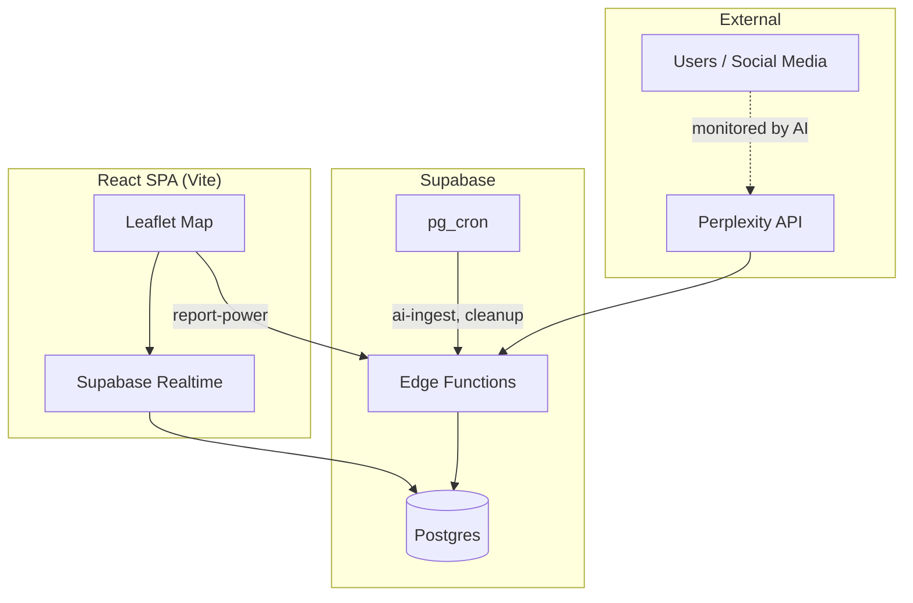
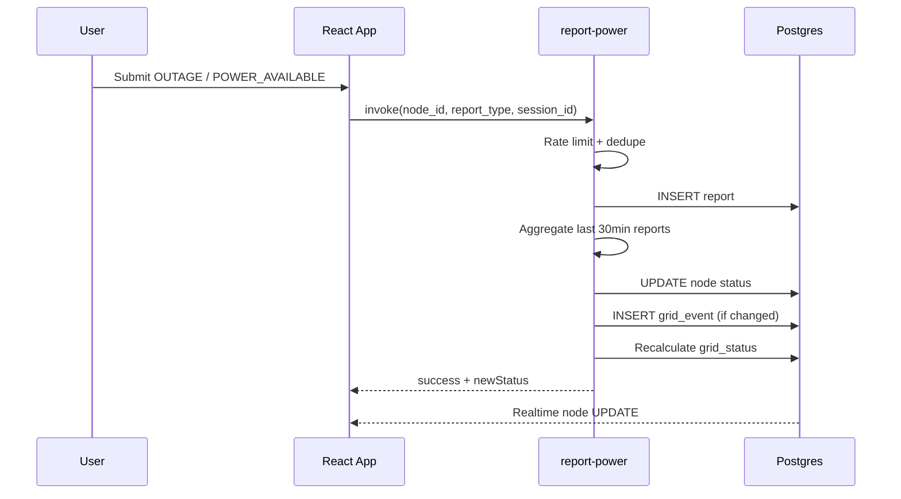
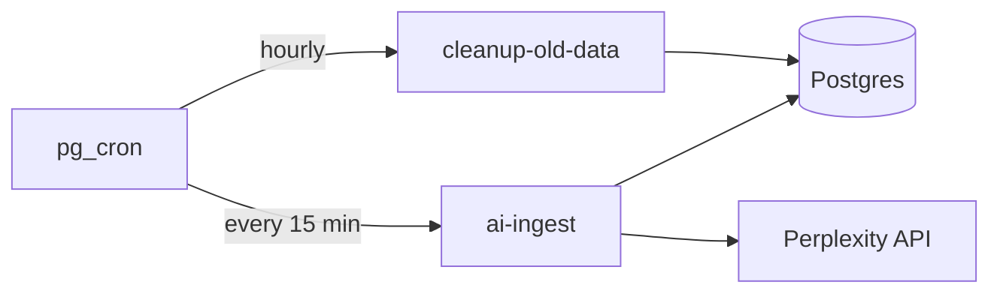

# GridWatch

**Real-time Nigerian power outage intelligence — open source, self-hostable, community-driven.**

[](LICENSE)
[](https://github.com/Spleez100/GridWatch/actions/workflows/ci.yml)
[](https://www.typescriptlang.org/)

GridWatch is an open-source platform that brings **transparency** to Nigeria's electricity grid. It combines **AI-powered social listening**, **crowdsourced reports**, and **real-time infrastructure mapping** to answer: *where is power out, why, and when might it return?*

Contributions are welcome — see [CONTRIBUTING.md](CONTRIBUTING.md).

---

## Problem Statement

Nigeria's electricity system suffers from a **transparency gap**:

- **No reliable outage maps** — DisCos rarely publish real-time outage data
- **Poor communication** — Restoration estimates are inconsistent or absent
- **Fragmented information** — Updates live on Twitter, WhatsApp, and local groups with no aggregation
- **Unreliable official channels** — National grid status is often learned through social media first

Millions of Nigerians check phones and neighbors before planning meals, work, or medical equipment use. GridWatch exists to **centralize, verify, and visualize** that scattered intelligence.

---

## Solution

GridWatch monitors the grid through three coordinated pipelines:

| Pipeline | Source | Output |
|----------|--------|--------|
| **Crowdsourced reports** | Anonymous users on the map | Node status updates via `report-power` |
| **AI ingest** | Perplexity search over social/news | `ai_events` + high-confidence node updates |
| **Scheduled cleanup** | pg_cron | Data retention + stale outage expiry |



---

## Features

- **Real-time outage monitoring** — Live map with node status colors and severity
- **AI-powered analysis** — Perplexity `sonar` extracts outage signals from Nigerian social discourse (Pidgin-aware)
- **Automated data aggregation** — Parallel search queries across DisCos, locations, and hashtags
- **Cron-based processing** — Hourly cleanup, 15-minute AI ingest (version-controlled in migrations)
- **Regional tracking** — TCN stations, feeders, transformers, service areas
- **Crowdsourced reports** — Rate-limited anonymous reporting with session deduplication
- **National grid status** — `GRID_STABLE` → `GRID_COLLAPSE` derived from outage ratios
- **Infrastructure drill-down** — Parent/child node hierarchy
- **Timeline & alerts** — Merged `grid_events` + `ai_events` with critical alert carousel
- **Self-hosting** — Docker, VPS, or static hosting + your own Supabase project

---

## Tech Stack

| Category | Technologies |
|----------|--------------|
| Frontend | React 18, TypeScript, Vite 5, Tailwind CSS, Framer Motion |
| Maps | Leaflet, CartoDB dark tiles |
| Backend | Supabase (Postgres 15, Realtime, Edge Functions) |
| Edge runtime | Deno |
| AI | Perplexity API (`sonar`) |
| Scheduling | pg_cron, pg_net |
| Testing | Vitest |
| CI | GitHub Actions |

---

## Architecture

### Request flow (user report)



### Cron flow



### Database tables

| Table | Purpose |
|-------|---------|
| `nodes` | Grid units (TCN → feeder → transformer → service area) |
| `reports` | Anonymous user reports |
| `grid_status` | Single-row national summary |
| `grid_events` | Timeline events |
| `ai_events` | AI-detected signals |
| `locations` | Geographic reference data |

---

## Installation

### Prerequisites

- Node.js 20+
- npm 10+
- [Supabase CLI](https://supabase.com/docs/guides/cli)
- Supabase project (cloud or local)
- Perplexity API key (for AI ingest)

### 1. Clone and install

```bash
git clone https://github.com/Spleez100/GridWatch.git
cd GridWatch
cp .env.example .env
npm install
```

### 2. Configure environment

Edit `.env`:

```env
VITE_SUPABASE_URL=https://YOUR_PROJECT.supabase.co
VITE_SUPABASE_PUBLISHABLE_KEY=your-anon-key
```

### 3. Supabase setup

```bash
supabase link --project-ref YOUR_PROJECT_REF
supabase db push
supabase secrets set CRON_SECRET=your-random-secret PERPLEXITY_API_KEY=pplx-xxx
```

Configure cron (run once on your database):

```sql
ALTER DATABASE postgres SET app.supabase_functions_url = 'https://YOUR_PROJECT.supabase.co/functions/v1';
ALTER DATABASE postgres SET app.cron_secret = 'your-random-secret';
```

### 4. Deploy edge functions

```bash
supabase functions deploy report-power
supabase functions deploy ai-ingest
supabase functions deploy cleanup-old-data
```

### 5. Seed data (optional, one-time)

```bash
curl -X POST "https://YOUR_PROJECT.supabase.co/functions/v1/seed-tcn-stations" \
  -H "x-cron-secret: your-random-secret"
```

### 6. Run locally

```bash
npm run dev
```

Open http://localhost:8080

---

## Environment Variables

### Frontend (`.env`)

| Variable | Required | Description |
|----------|----------|-------------|
| `VITE_SUPABASE_URL` | Yes | Supabase project URL |
| `VITE_SUPABASE_PUBLISHABLE_KEY` | Yes | Supabase anon/public key |

### Edge function secrets (`supabase secrets set`)

| Variable | Required | Description |
|----------|----------|-------------|
| `SUPABASE_URL` | Auto | Injected by Supabase |
| `SUPABASE_SERVICE_ROLE_KEY` | Auto | Injected by Supabase |
| `CRON_SECRET` | Yes | Protects admin/cron edge functions |
| `PERPLEXITY_API_KEY` | Yes (AI) | Perplexity API key for `ai-ingest` |

### Database settings (cron)

| Setting | Description |
|---------|-------------|
| `app.supabase_functions_url` | Base URL for edge function invocation |
| `app.cron_secret` | Must match `CRON_SECRET` edge secret |

---

## API Reference

GridWatch uses **Supabase Edge Functions** (not a custom REST API).

### `POST /functions/v1/report-power`

Public — called from the frontend.

**Body:**
```json
{
  "node_id": "uuid",
  "report_type": "OUTAGE | POWER_AVAILABLE | INTERMITTENT",
  "session_id": "uuid"
}
```

**Rate limits:** 3 reports/hour/node/session; 5-minute duplicate suppression.

**Response:**
```json
{
  "success": true,
  "newStatus": "OUTAGE",
  "confidence": 65,
  "gridStatus": "GRID_FLUCTUATING"
}
```

### `POST /functions/v1/ai-ingest`

Protected — requires `x-cron-secret` header. Runs on schedule.

### `POST /functions/v1/cleanup-old-data`

Protected — requires `x-cron-secret` header. Runs hourly.

### Direct database (anon key + RLS)

| Table | Client access |
|-------|---------------|
| `nodes`, `grid_status`, `grid_events`, `ai_events`, `locations` | SELECT + Realtime |
| `reports` | SELECT only (INSERT via edge function) |

---

## Cron Job System

| Job | Schedule | Function |
|-----|----------|----------|
| `gridwatch-cleanup-old-data` | `0 * * * *` (hourly) | Delete 48h+ ephemeral data; expire 6h stale outages |
| `gridwatch-ai-ingest` | `*/15 * * * *` | Run Perplexity searches and apply signals |

Defined in `supabase/migrations/20260515000000_security_and_cron.sql`.

---

## AI System

1. **Query selection** — 3 random queries from groups (Twitter outage/restoration, infrastructure, DisCos, locations, hashtags, national grid)
2. **Search** — Parallel Perplexity `sonar` calls with `search_recency_filter: day`
3. **Extraction** — Structured JSON schema for signals (location, severity, confidence, infrastructure detail)
4. **Dedup** — 15-minute window against existing `ai_events`
5. **Node matching** — Fuzzy match to `nodes` table
6. **Apply** — Confidence > 60 updates node + propagates to children
7. **Grid recalc** — National status updated

Nigerian linguistics (Pidgin, DisCo names, TCN stations) are encoded in the extraction prompt.

---

## Deployment

### Vercel / Netlify (static frontend)

```bash
npm run build
# Deploy dist/ — set VITE_* env vars in dashboard
```

### Docker

```bash
docker compose build
docker compose up -d
```

### Railway

Deploy repo with build command `npm run build`, start command `npx serve dist`, and set `VITE_*` variables.

### VPS / Ubuntu

```bash
npm ci && npm run build
# Serve dist/ with nginx — see nginx.conf
# Run Supabase cloud or self-hosted stack separately
```

---

## Contributing

See [CONTRIBUTING.md](CONTRIBUTING.md) for branch naming, commit conventions, and PR process.

---

## Security

See [SECURITY.md](SECURITY.md) for vulnerability reporting.

**Before going public:** rotate Supabase keys if `.env` was ever committed.

---

## Maintainer

**Pelumi** — creator of GridWatch

- GitHub: [@Spleez100](https://github.com/Spleez100)
- Questions: [GitHub Discussions](https://github.com/Spleez100/GridWatch/discussions)

---

## License

[MIT](LICENSE) © Pelumi

---

## Roadmap

See [ROADMAP.md](ROADMAP.md) for planned features.

## Audit & migration notes

See [docs/AUDIT.md](docs/AUDIT.md) for the full pre-OSS audit report.
